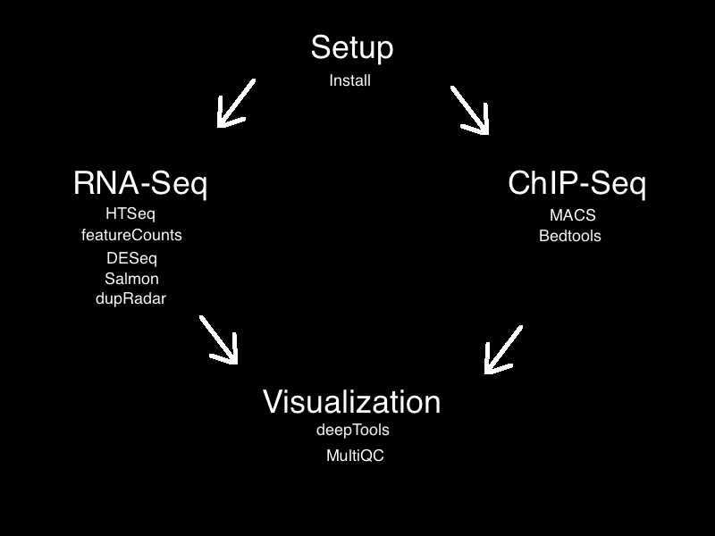
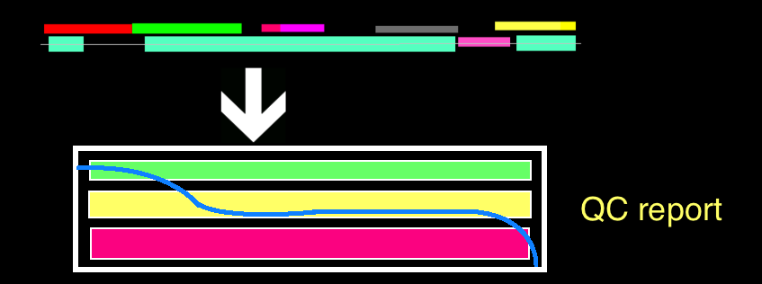
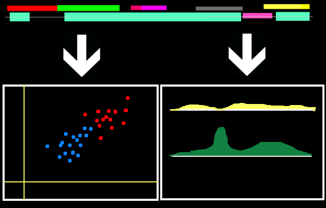
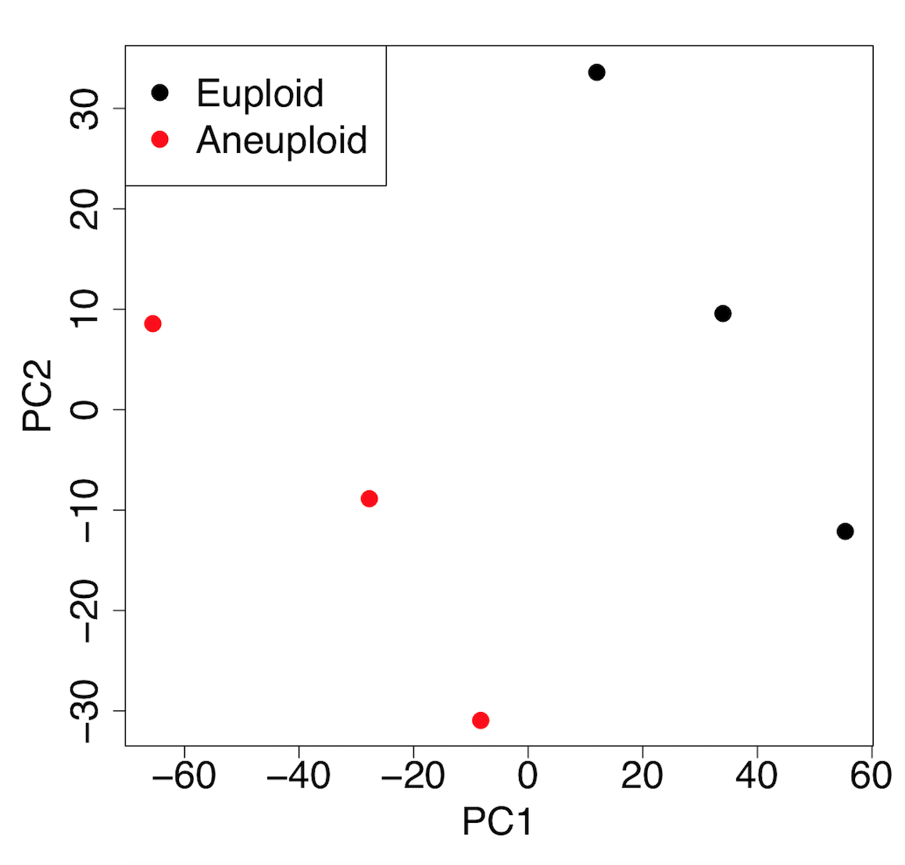
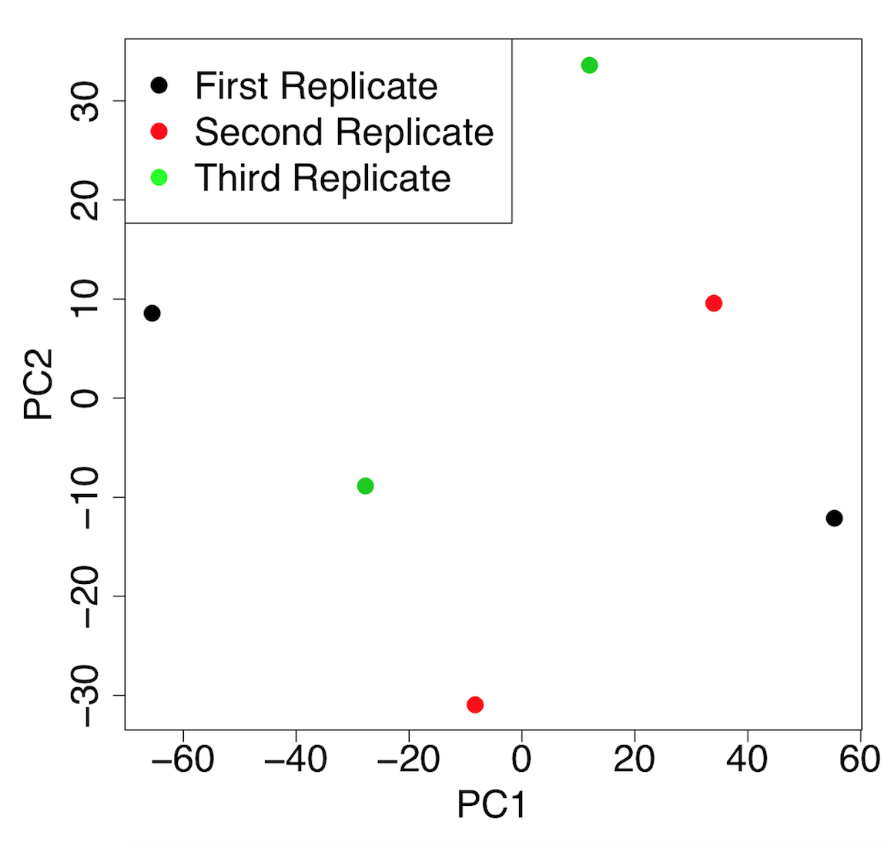

# SeqAcademy
### An easy-to-use, all-in-one jupyter notebook tutorial for the RNA-Seq and ChIP-Seq pipeline

##### We recommend at least 4 processors with at least 16 GB RAM each
##### Total disk space required (includes large SAM files): 350 GB

[Ready to get going? Jump to "How do I use SeqAcademy?" and get started!](#how-do-i-use-seqacademy)

<b>Keywords</b>:
<i>RNA-Seq, ChIP-Seq, alignment, assembly, education, tutorial, pipeline</i>

## What is SeqAcademy?

SeqAcademy is a user-friendly jupyter notebook-based educational pipeline for RNA-Seq and epigenomic data analysis.

 
RNA-Seq and ChIP-Seq experiments generate large amounts of data and rely on pipelines for efficient analysis.  However, existing tools perform specific portions of the pipeline or offer a complete pipeline solution for the advanced programmer.

 
SeqAcademy addresses these problems by providing an easy to use tutorial that outlines the complete RNA-Seq and ChIP-Seq analysis workflow and requires no prior programming experience.  

  
<b>Demo: </b><a href="http://asbcb.org/seqacademy.html">SeqAcademy</a>
  

## Who is SeqAcademy for?

SeqAcademy is for students and researchers with little to no bioinformatics experience interested in hands-on bioinformatics tutorials.  Anyone will feel comfortable analyzing epigenomic and RNA-Seq data using this simple educational tool.

## How do I use SeqAcademy?

1. Identify and open the terminal emulator program on your computer. Mac and Linux systems come with Terminal installed, and Windows systems come with Console. If there isn't one installed, download one online. 

2. Type `pwd` and press enter. This command shows what your current working directory is. Typing commands and pressing enter will be the primary way of running commands in this tutorial. Type `ls` to display which directories and files are in this current directory.

3. If you'd like to use the tutorial in this current working directory, skip to step 4. Otherwise, you may make a new directory or move to another one. To make a new directory, run `mkdir DIRECTORY` in which DIRECTORY is the name of the directory you'd like to make. To move to another directory, run `cd DIRECTORY` in which DIRECTORY is the name of the DIRETORY you'd like to move to. To move up a directory, run `cd ..`. 

4. Download anaconda (https://www.anaconda.com/download/) and jupyter notebook (http://jupyter.readthedocs.io/en/latest/install.html) 

5. Run `git clone https://github.com/NCBI-Hackathons/seqacademy.git`

6. Run `cd seqacademy`.

7. Run `jupyter notebook` to launch jupyter notebook from your internet browser.

If you run into a warning about the connection's privacy, proceed anyway.

8. Click `tutorial.ipynb` and follow the instructions of the tutorial. 

# What are the steps of this tutorial?

This tutorial works using HISAT2 aligner to align sample reads to a reference.

Then it performs MultiQC to extract quality control information from the aligned reads.

It uses quantification methods (such as salmon for RNA-Seq and peak-calling for ChIP-Seq) to quantify expression and determine protein-binding. 

The output is analyzed (differential gene expression for RNA-Seq and peak analysis for ChIP-seq), and the results are visualized.

The model organism for this project is Yeast i.e. <i>Saccharomyces cerevisiae</i>. For RNA-Seq, yeast data between euploid and aneuoploid conditions will be compared. For ChIP-SEq, yeast data between 3AT-treated and untreated conditions will be compared.

## RNA-Seq

The following data presents the RNA-Seq data used in this tutorial. 

|              |            |        |        |            |            |             |           |           |            |            |             |             |         |                    |                    |            |                     |               |                  |                |            |                          |          |             |           |             |        | 
|--------------|------------|--------|--------|------------|------------|-------------|-----------|-----------|------------|------------|-------------|-------------|---------|--------------------|--------------------|------------|---------------------|---------------|------------------|----------------|------------|--------------------------|----------|-------------|-----------|-------------|--------| 
| BioSample    | Experiment | MBases | MBytes | Run        | SRA_Sample | Sample_Name | karyotype | replicate | Assay_Type | AvgSpotLen | BioProject  | Center_Name | Consent | DATASTORE_filetype | DATASTORE_provider | InsertSize | Instrument          | LibraryLayout | LibrarySelection | LibrarySource  | LoadDate   | Organism                 | Platform | ReleaseDate | SRA_Study | source_name | strain | 
| SAMN06859211 | SRX2775581 | 1632   | 575    | SRR5494627 | SRS2158877 | GSM2595338  | Aneuploid | First     | RNA-Seq    | 51         | PRJNA385090 | GEO         | public  | sra                | ncbi               | 0          | Illumina HiSeq 2500 | SINGLE        | cDNA             | TRANSCRIPTOMIC | 2017-05-02 | Saccharomyces cerevisiae | ILLUMINA | 2017-09-12  | SRP106028 | Yeast cells | S288c  | 
| SAMN06859210 | SRX2775582 | 940    | 331    | SRR5494628 | SRS2158878 | GSM2595339  | Aneuploid | Second    | RNA-Seq    | 51         | PRJNA385090 | GEO         | public  | sra                | ncbi               | 0          | Illumina HiSeq 2500 | SINGLE        | cDNA             | TRANSCRIPTOMIC | 2017-05-02 | Saccharomyces cerevisiae | ILLUMINA | 2017-09-12  | SRP106028 | Yeast cells | S288c  | 
| SAMN06859209 | SRX2775583 | 1195   | 421    | SRR5494629 | SRS2158879 | GSM2595340  | Aneuploid | Third     | RNA-Seq    | 51         | PRJNA385090 | GEO         | public  | sra                | ncbi               | 0          | Illumina HiSeq 2500 | SINGLE        | cDNA             | TRANSCRIPTOMIC | 2017-05-02 | Saccharomyces cerevisiae | ILLUMINA | 2017-09-12  | SRP106028 | Yeast cells | S288c  | 
| SAMN06859208 | SRX2775584 | 815    | 288    | SRR5494630 | SRS2158880 | GSM2595341  | Euploid   | First     | RNA-Seq    | 51         | PRJNA385090 | GEO         | public  | sra                | ncbi               | 0          | Illumina HiSeq 2500 | SINGLE        | cDNA             | TRANSCRIPTOMIC | 2017-05-02 | Saccharomyces cerevisiae | ILLUMINA | 2017-09-12  | SRP106028 | Yeast cells | S288c  | 
| SAMN06859207 | SRX2775585 | 946    | 333    | SRR5494631 | SRS2158881 | GSM2595342  | Euploid   | Second    | RNA-Seq    | 51         | PRJNA385090 | GEO         | public  | sra                | ncbi               | 0          | Illumina HiSeq 2500 | SINGLE        | cDNA             | TRANSCRIPTOMIC | 2017-05-02 | Saccharomyces cerevisiae | ILLUMINA | 2017-09-12  | SRP106028 | Yeast cells | S288c  | 
| SAMN06859206 | SRX2775586 | 1152   | 407    | SRR5494632 | SRS2158882 | GSM2595343  | Euploid   | Third     | RNA-Seq    | 51         | PRJNA385090 | GEO         | public  | sra                | ncbi               | 0          | Illumina HiSeq 2500 | SINGLE        | cDNA             | TRANSCRIPTOMIC | 2017-05-02 | Saccharomyces cerevisiae | ILLUMINA | 2017-09-12  | SRP106028 | Yeast cells | S288c  | 

# ChIP-Seq

The following data presents the ChIP-Seq data used in this tutorial. 

|            |              |            |        |        |            |            |             |                                               |                        |        |            |             |             |         |                    |                    |            |             |               |                  |                |            |                          |          |             |           | 
|------------|--------------|------------|--------|--------|------------|------------|-------------|-----------------------------------------------|------------------------|--------|------------|-------------|-------------|---------|--------------------|--------------------|------------|-------------|---------------|------------------|----------------|------------|--------------------------|----------|-------------|-----------| 
| AvgSpotLen | BioSample    | Experiment | MBases | MBytes | Run        | SRA_Sample | Sample_Name | genotype                                      | source_name            | strain | Assay_Type | BioProject  | Center_Name | Consent | DATASTORE_filetype | DATASTORE_provider | InsertSize | Instrument  | LibraryLayout | LibrarySelection | LibrarySource  | LoadDate   | Organism                 | Platform | ReleaseDate | SRA_Study | 
| 148        | SAMN08513506 | SRX3677830 | 8816   | 3690   | SRR6703656 | SRS2938492 | GSM2991004  | MATa ade2-1 can1-100 leu2-3,112 trp1-1 ura3-1 | Untreated              | YDC111 | RNA-Seq    | PRJNA433659 | GEO         | public  | sra                | ncbi               | 0          | NextSeq 500 | PAIRED        | cDNA             | TRANSCRIPTOMIC | 2018-02-09 | Saccharomyces cerevisiae | ILLUMINA | 2018-02-27  | SRP132584 | 
| 148        | SAMN08513513 | SRX3677835 | 9614   | 4022   | SRR6703661 | SRS2938497 | GSM2991009  | MATa ade2-1 can1-100 leu2-3,112 trp1-1 ura3-1 | 3AT-treated for 40 min | YDC111 | RNA-Seq    | PRJNA433659 | GEO         | public  | sra                | ncbi               | 0          | NextSeq 500 | PAIRED        | cDNA             | TRANSCRIPTOMIC | 2018-02-09 | Saccharomyces cerevisiae | ILLUMINA | 2018-02-27  | SRP132584 | 
| 150        | SAMN08513512 | SRX3677836 | 6049   | 2749   | SRR6703662 | SRS2938498 | GSM2991010  | MATa ade2-1 can1-100 leu2-3,112 trp1-1 ura3-1 | Untreated              | YDC111 | RNA-Seq    | PRJNA433659 | GEO         | public  | sra                | ncbi               | 0          | NextSeq 500 | PAIRED        | cDNA             | TRANSCRIPTOMIC | 2018-02-09 | Saccharomyces cerevisiae | ILLUMINA | 2018-02-27  | SRP132584 | 
| 150        | SAMN08513511 | SRX3677837 | 6918   | 3140   | SRR6703663 | SRS2938499 | GSM2991011  | MATa ade2-1 can1-100 leu2-3,112 trp1-1 ura3-1 | 3AT-treated for 40 min | YDC111 | RNA-Seq    | PRJNA433659 | GEO         | public  | sra                | ncbi               | 0          | NextSeq 500 | PAIRED        | cDNA             | TRANSCRIPTOMIC | 2018-02-09 | Saccharomyces cerevisiae | ILLUMINA | 2018-02-27  | SRP132584 | 

# Authors
+ Syed Hussain Ather (shussainather@gmail.com) (http://hussainather.com)
+ Olaitan Awe (laitanawe@gmail.com)
+ TJ Butler (tjbutler003@gmail.com)
+ Tamiru Denka (tamiru.dank@nih.gov)
+ Stephen Semick (stephen.semick@libd.org)
+ Wanhu Tang (tangw2@niaid.nih.gov)
